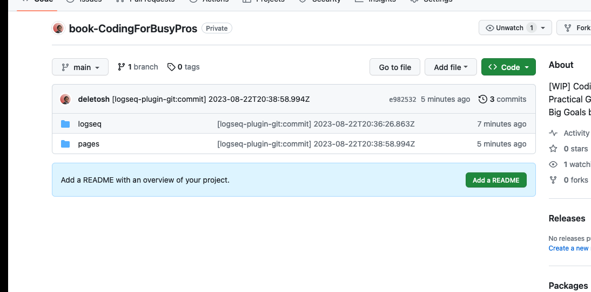

- Needs:
  collapsed:: true
	- https://www.quora.com/How-can-I-learn-programming-with-a-busy-life
	- https://codeillusion.io/pages/coding-for-adults
	- https://medium.com/@nevillealee/learn-to-code-with-a-busy-schedule-6af6b3e2df35
	- https://www.codecademy.com/resources/blog/tips-for-busy-people-learning-to-code/
- A project-based approach to learning the basic ideas of JS
- Will be written in the "Atomic Style" and Learn Python the Hard Way
- **JavaScript**
	- Tools
		- VSCode
	- [JSitor](https://jsitor.com/)
	- 
		-
- Project
- Web Coding
- R
- React Native
  collapsed:: true
	- Tools
	  collapsed:: true
		- Genymotion